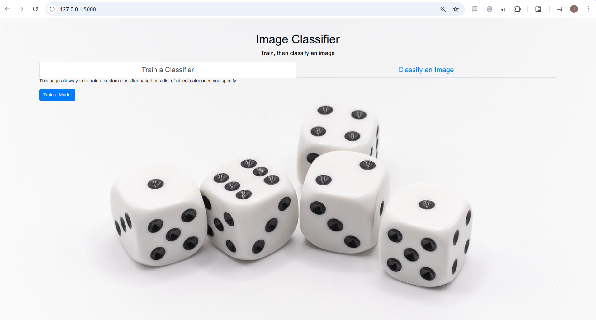

# ALX Portfolio Project (Image Classifier)

This project combines my interest in Computer Vision and Software Engineering. Users can have fun training a Convolutional Neural Network (CNN) to classify common images of their choice without worrying about how CNNs work, and can evaluate the performance of their trained model on test images.

## Features


## Technologies Used

- **Python**: Backend development
- **FastAI**: For training the Convolutional Neural Network
- **Flask**: Web framework for building the application
- **HTML/CSS**: Frontend structure and styling

## Installation

To run this project locally, follow these steps:

1. **Clone the repository**:

   ```bash
   git clone https://github.com/Bayzman/portfolio_project.git
   cd portfolio_project

2. **Create a virtual environment**:
   ```bash
   python3 -m venv venv
   source venv/bin/activate

3. **Install the required packages**:
   ```bash
   pip install

4. **Run the application**:
   ```bash
   python3 app.py

5. **Access the application**:
   ```bash
   Open your browser and navigate to http://127.0.0.1:5000/
